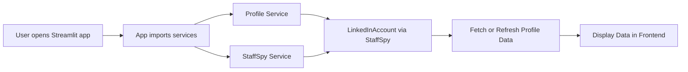
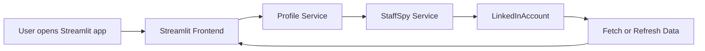

# Linkedin-Profile-Scrapper

This project is a **LinkedIn automation tool** that interacts with LinkedIn accounts using `staffspy`. It allows you to **fetch and refresh profiles, perform staff analysis, and display information via a frontend** built with Streamlit.

This README will guide you **step-by-step**, even if you’re new to Python or development.

---

## 🧩 Project Overview

**High-Level Flow:**



**Explanation of Flow:**

- **User opens app** → Streamlit frontend loads.
- **App imports backend services** → profile service and staff spy service.
- **Profile Service** → manages LinkedIn profile fetch/refresh logic.
- **StaffSpy Service** → interacts with LinkedIn accounts using the `staffspy` package.
- **Data returned** → Streamlit frontend displays profile data and analytics.

---

## ⚙️ Requirements

- Python 3.10+
- macOS, Windows, or Linux
- Internet connection

---

## 🛠️ Installation Guide

### 1\. Install Python

Check if Python is installed:

```bash
python3 --version
```

If not, download from [Python.org](https://www.python.org/).

### 2\. Create a Virtual Environment (Recommended)

```bash
python3 -m venv test
```

Activate it:

**macOS/Linux:**

```bash
source test/bin/activate
```

**Windows:**

```bash
.\test\Scripts\activate
```

### 3\. Install Required Packages

Install main dependencies:

```bash
pip install streamlit pandas requests python-dotenv sqlalchemy psycopg2-binary
```

Install `StaffSpy` (the LinkedIn automation package):

```bash
pip install staffspy
```

⚠️ Make sure you install `staffspy` in the **same environment** you’ll run Streamlit from.

### 4\. Set Up Environment Variables

Create a `.env` file in your project folder with:

```
LINKEDIN_USERNAME=your_username
LINKEDIN_PASSWORD=your_password
```

This is used by `staffspy` to login to LinkedIn securely.

### 5\. Run the App

Run Streamlit with the correct environment:

```bash
python -m streamlit run app.py
```

Open the URL printed in your terminal (usually `http://localhost:8501`) to see the frontend.

---

## 🖥️ How It Works

- **Frontend (Streamlit)** → User interface to fetch or refresh LinkedIn profiles.
- **Backend services** → Python code that calls StaffSpy to get profile and staff data.
- **Data is displayed** dynamically on the web interface.

---

## 🔄 Typical Workflow

1.  Open Streamlit app.
2.  Click `Fetch Profile`.
3.  App uses `StaffSpy` to log in and fetch LinkedIn data.
4.  Data is stored or updated.
5.  Dashboard shows profile analytics.

---

## ⚡ Troubleshooting

| Issue                                             | Fix                                                                                                                                                          |
| ------------------------------------------------- | ------------------------------------------------------------------------------------------------------------------------------------------------------------ |
| `ModuleNotFoundError: No module named 'staffspy'` | Make sure `staffspy` is installed in the environment. Run `pip install staffspy`. Use `python -m streamlit run app.py` to ensure correct Python environment. |
| LinkedIn login fails                              | Double-check `.env` credentials. LinkedIn may block login from an unknown IP.                                                                                |
| Streamlit not opening                             | Check firewall or try `http://localhost:8501` manually in your browser.                                                                                      |

---

## 📊 Flowchart (Visual)



This shows how the **frontend interacts with the backend** and how **data flows from LinkedIn to the user interface**.

---

## ✅ Summary

1.  Install Python and create a virtual environment.
2.  Install dependencies including `staffspy`.
3.  Set your LinkedIn credentials in `.env`.
4.  Run Streamlit with `python -m streamlit run app.py`.
5.  Use the dashboard to fetch, refresh, and visualize LinkedIn profile data.

---

```

```
